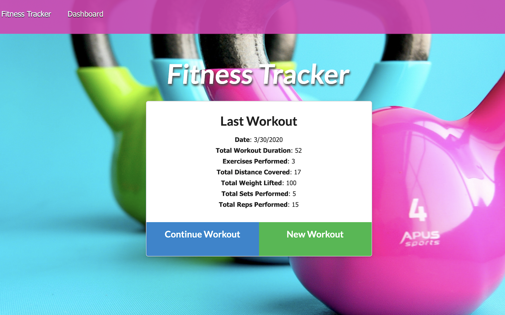
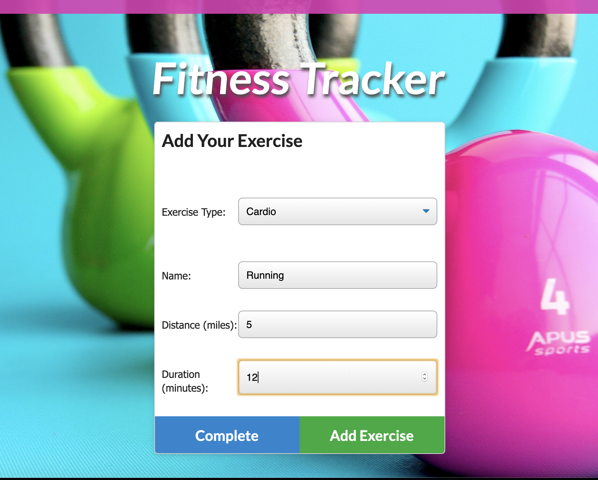
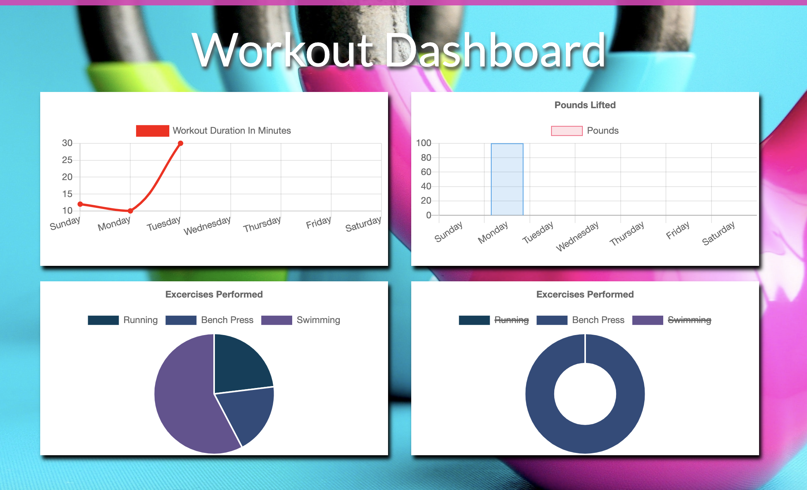

# Fitness-Tracker

A workout logging application that allows users to create, add to, view, and track daily workout routines.

Deployed Application: https://murmuring-retreat-60695.herokuapp.com/

## User Story

As a health conscious individual, I want the ability to track my daily workouts, so that I can easily review my weekly trends.

## Usage

Users of the Workout Tracker have the option to create a new workout, continue an existing workout, add an exercise to a workout, and view the weeks workout data on multiple graphs.

#### Main Page

#### Add a workout

#### View your weekly workout data

## Technologies Used

- Mongoose
- MongoDB
- Express
- Node.js
- Javascript
- HTML
- CSS
