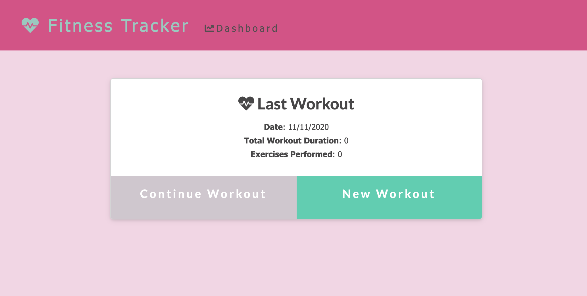

# Workout-Tracker
A workout logging application allowing users to view, add, and track daily workouts.

## User Story
As a health conscious individual, I want the ability to track my daily workouts, so that I can easily review my weekly routine trends.

## Usage
Users of the Workout Tracker have the option to create a new workout, continue an existing workout, add an exercise to a workout, and  view the weeks workout data on multiple graphs.

#### Main Page

#### Add a workout

#### View your weekly workout data
